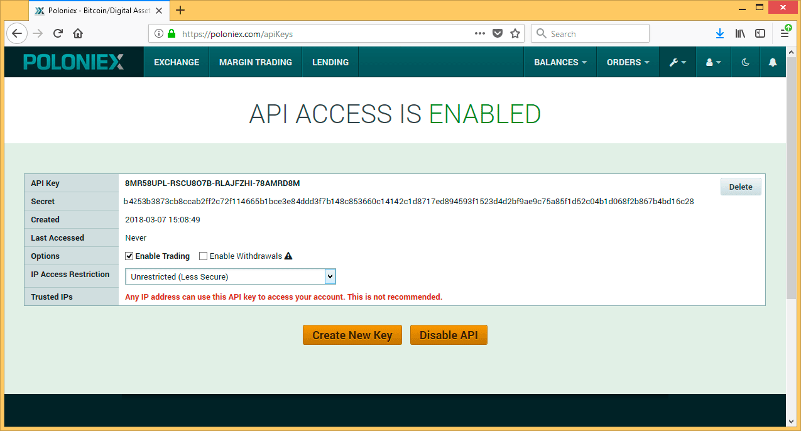

# Exchange API Key

The AAPlatform places orders on exchanges through the use of the exchanges' APIs. You will need to create an API Key and configure your bot to use it.

## Creating the API Key

This is how you create an API Key in Poloniex:

Go to the tools menu and select _API KEYS_...


If you have never used the API before, chances are it is disabled at the exchange. So before actually creating an API Key you will need to enable them...


You will need to follow the validation process involving checking your email and confirming your choice. Once that is taken care of, go back to the tools menu and click _API KEY_ again. You should now see a screen offering to create a new key...


Once you create your key, the system will present it as follows...



**Make sure you DO NOT enable withdrawals nor IP access restrictions**.

## Creating an API Key File

Next, you will use the information in the API Key to a create a _.json_ file with the following structure using your own Key and Secret information:

```
{ "Key" : "6HS4YUEB-865UY9W4-KGHEHHJ-GH72ETG1", "Secret" : "1a3529851a05439asdasdw63426378ggd65701ac4a5d53c4859aa3511a8aa65acbd7e713bba755d0b1591ebe3a7618a71393ef4d3d11310628e1db"}
```

Create a folder named _API-Keys_ at the same level of the platform's repository (out of the folder AACloud) and save the file using the following naming convention:

"**AA**" + **BotName** + "**.**" + **ExchangeName** + "**.json**"

e.g.: AAMariam.Poloniex.json

```
.                                       
+-- AACloud                             # You cloned this from git repository
+-- API-Keys                            # Create this dir at same level as AACloud
      +-- AAYourAlgobot.Poloniex.json   # Place your Poloniex API Key file here
```

**NOTE: Make sure the folder and file doesn't accidentally end up in GitHub! Your API KEYs should be kept secret!**
